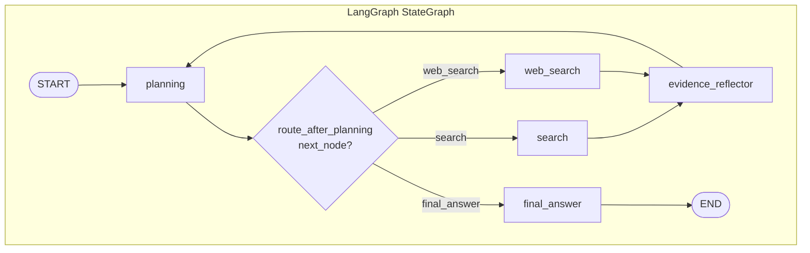

# Agent-UniRAG

[](https://arxiv.org/abs/2505.22571)

Unified RAG agent for single-hop and multi-hop question answering, implemented with [LangGraph](https://github.com/langchain-ai/langgraph). Based on the paper [Agent-UniRAG: A Trainable Open-Source LLM Agent Framework for Unified Retrieval-Augmented Generation Systems](https://arxiv.org/abs/2505.22571). This repo implements the **inference** graph and prompts (planning, search, web search, evidence reflector, final answer) as in the paper; training/fine-tuning is out of scope.

## Architecture

The agent is a [LangGraph](https://github.com/langchain-ai/langgraph) `StateGraph` with five nodes and conditional routing after planning:

- **Planning**: LLM decides the next action (document search, web search, or final answer) in ReAct style (Thought / Search Input or Web Search Input / Observation).
- **Search**: Retrieves top-k documents from the uploaded knowledge base (e.g. PDF in Chroma).
- **Web search**: Separate module using OpenAI's built-in web search (Responses API with `web_search` tool). Uses the same `OPENAI_API_KEY` and `OPENAI_MODEL`; web search calls incur additional tool-usage cost (see [OpenAI pricing](https://openai.com/api/pricing/)).
- **Evidence Reflector**: Condenses retrieved sources (from either search or web_search) into focused evidence.
- **Final Answer**: Produces the long-form answer from the question and gathered evidence.

Flow: Question -> Planning -> (search | web_search -> Evidence Reflector -> Planning)\* -> Final Answer.



- **Nodes**: `planning`, `search`, `web_search`, `evidence_reflector`, `final_answer` (names match the code in `graph.py`).
- **Edges**: `START` -> `planning`; conditional from `planning` to `search`, `web_search`, or `final_answer` via `route_after_planning(state)`; both `search` and `web_search` -> `evidence_reflector` -> `planning` (loop); `final_answer` -> `END`.

Diagram is in [Mermaid](https://mermaid.js.org/); view the README on GitHub or any Mermaid-capable viewer to render it.

## Scope (vs paper)

This repository implements the **inference-time** agent from the paper: the graph, prompts (Figures 8, 9, 14), document search, web search, evidence reflector, and final answer. **Training, fine-tuning, and other "trainable" aspects of the paper are not implemented**; the agent uses off-the-shelf LLMs (e.g. OpenAI) with the paper's prompt templates. Future work could add training or adaptation pipelines; for now, people should expect inference-only usage.

## Enhancements (not in the paper)

The following are **additions in this repo** and are not part of the original paper:

- **PDF-only vs Web-only mode**: The paper describes a single agent that can use both document search and web search in the same run. Here we add a **mode** (`pdf` or `web`) so the user chooses one source per question: either search only over the uploaded PDF or only over the web. The planner sees only the relevant tool (separate prompts per mode), and the UI hides the PDF upload section when Web search is selected. This keeps runs focused and avoids mixing document and web evidence unless you extend the design.
- **Date-aware web search**: Current date in the planning prompt and instructions to avoid appending arbitrary years (e.g. 2023) to web queries when the user does not ask for a specific year.
- **Flow graph from backend**: The API returns a React Flow–compatible graph in the stream `done` event so the UI can render an execution flowchart (planning, decision, search, evidence reflector, final answer) without client-side layout logic.
- **Backend readiness check**: `OPENAI_API_KEY` is validated at API startup (process exits if unset); the frontend calls `GET /ready` and blocks the UI until the backend is ready.

## Setup

Using [uv](https://docs.astral.sh/uv/) (recommended):

```bash
uv sync
```

Or with pip:

```bash
pip install -r requirements.txt
```

Optional: for vector-store retrieval, install `chromadb` and `langchain-community` (see `pyproject.toml` optional-dependencies).

## Configuration

- **LLM**: Set `OPENAI_API_KEY` for the default OpenAI runner. Use `OPENAI_MODEL` (default: `gpt-4o-mini`) to change the model.
- **Computing budget**: `AGENT_MAX_SEARCHES` limits the number of search steps (default: 5). `AGENT_TOP_K` is documents per search (default: 8).
- **Retrieval**: The API uses LangChain + ChromaDB for PDF: upload a PDF via `POST /documents` (or the frontend). PDFs are loaded with LangChain's `PyPDFLoader`, chunked with `RecursiveCharacterTextSplitter`, embedded with OpenAI (`text-embedding-3-small` by default), and stored in an in-memory Chroma collection. Set `OPENAI_EMBEDDING_MODEL` to use another embedding model. For CLI or custom pipelines, replace with your own retriever implementing the same interface.

## Run (CLI)

Set `OPENAI_API_KEY` (required; the script calls the LLM for planning, evidence extraction, and final answer).

```bash
export OPENAI_API_KEY=your_key
uv run python run_agent.py
```

Or with pip: `PYTHONPATH=src python run_agent.py`, or `pip install -e . && python run_agent.py`.

## API (FastAPI)

Run the HTTP API locally:

```bash
export OPENAI_API_KEY=your_key
uv run uvicorn agent_unirag.api:app --reload --host 0.0.0.0 --port 8000
```

Endpoints:

- `GET /health` – health check (`{"status": "ok"}`).
- `GET /ready` – readiness (503 if `OPENAI_API_KEY` not set).
- `GET /documents` – number of chunks in the retriever (`{"chunk_count": N}`). Used when indexing an uploaded PDF.
- `POST /documents` – upload a PDF (multipart `file`). Replaces the current document corpus: LangChain loads and chunks the PDF, OpenAI embeds chunks, ChromaDB stores them; questions are answered via semantic search over this PDF.
- `POST /ask` – body `{"question": "Your question?", "mode": "pdf"|"web", "conversation": [{"question": "...", "answer": "..."}]}`. `mode`: `"pdf"` = document search only, `"web"` = web search only (default `"pdf"`). Optional `conversation` for follow-up context (last 5 turns used). Returns `question`, `final_answer`, `step_count`, `gathered_evidence`, `trajectory`.
- `POST /ask/stream` – **SSE**: same body as `/ask`; response is `text/event-stream`. Events: `planning`, `search` or `web_search`, `evidence_reflector`, `final_answer`, then `done` (with `flow_graph` for flowchart UI).

CORS is enabled for all origins so a separate UI can call the API. Docs: http://localhost:8000/docs when the server is running.

## Frontend (Next.js)

A Next.js UI in `frontend/` calls the API to ask questions and optionally stream progress via SSE. You can upload a single PDF as the knowledge base; the agent then searches over it using LangChain (load + chunk) and ChromaDB (vector store with OpenAI embeddings). The UI keeps conversation history and sends it with each request so you can ask follow-up questions (e.g. "What about the second one?") with context; use "Clear" to start a new thread. Uploading a new PDF clears the conversation (one document = one logical thread). History is client-side only and is lost on refresh; for persistent threads you could add a `thread_id` and server-side session store later.

**Local development:**

```bash
cd frontend
npm install
cp .env.example .env.local
# Set NEXT_PUBLIC_API_URL=http://localhost:8000 (default)
npm run dev
```

Open http://localhost:3000. Ensure the API is running on port 8000.

**Production build:** `npm run build` then `npm start`.

## Docker

Build and run API and frontend with [Docker Compose](https://docs.docker.com/compose/). The API image uses [uv](https://docs.astral.sh/uv/); the frontend uses Next.js standalone.

Create a `.env` file (see `.env.example`):

```bash
cp .env.example .env
# Edit .env and set OPENAI_API_KEY=...
```

Then:

```bash
docker compose up --build
```

- **API:** http://localhost:8000
- **Frontend:** http://localhost:3000 (use this to ask questions in the browser)

The frontend is built with `NEXT_PUBLIC_API_URL=http://localhost:8000` so the browser can call the API when both services run on the same host. To run the API container only (no compose):

```bash
docker build -t agent-unirag .
docker run -e OPENAI_API_KEY=your_key -p 8000:8000 agent-unirag
```

This runs a single example question with the mock retriever. To use your own retriever and question, call the package from Python:

```python
from langchain_openai import ChatOpenAI
from agent_unirag import create_agent_unirag_graph
from agent_unirag.retriever import MockRetriever

llm = ChatOpenAI(model="gpt-4o-mini", temperature=0)
retriever = MockRetriever()  # or your RetrieverProtocol implementation
graph = create_agent_unirag_graph(llm=llm, retriever=retriever, max_searches=5, top_k=8)

result = graph.invoke({
    "question": "Your question here.",
    "trajectory": "",
    "gathered_evidence": [],
    "retrieved_sources": [],
    "step_count": 0,
    "final_answer": None,
})
print(result["final_answer"])
```
